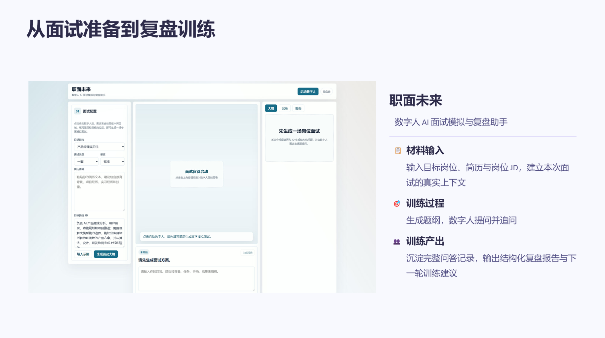
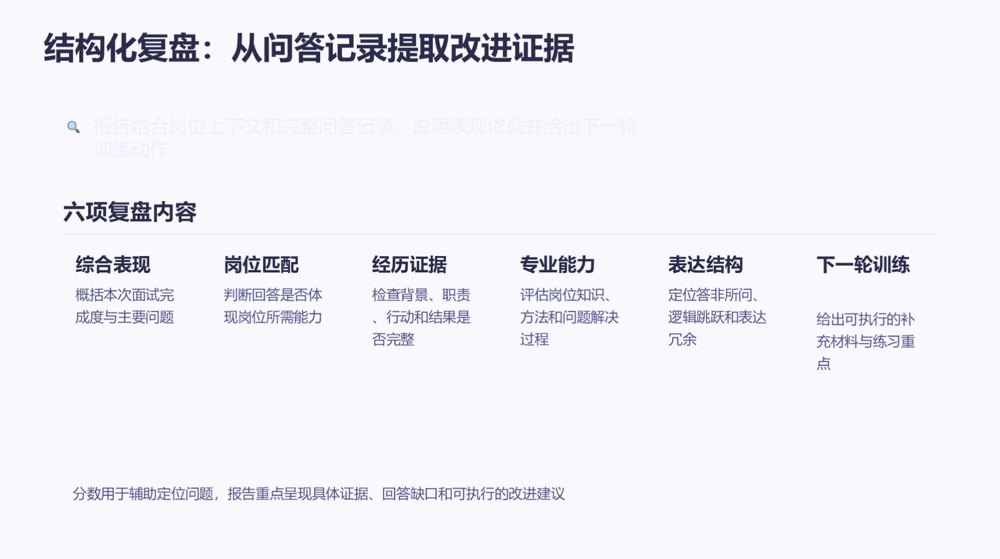
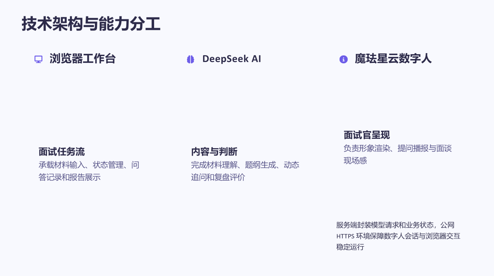
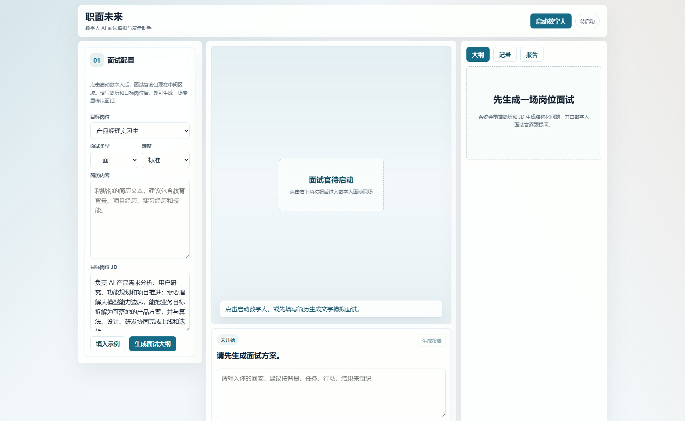
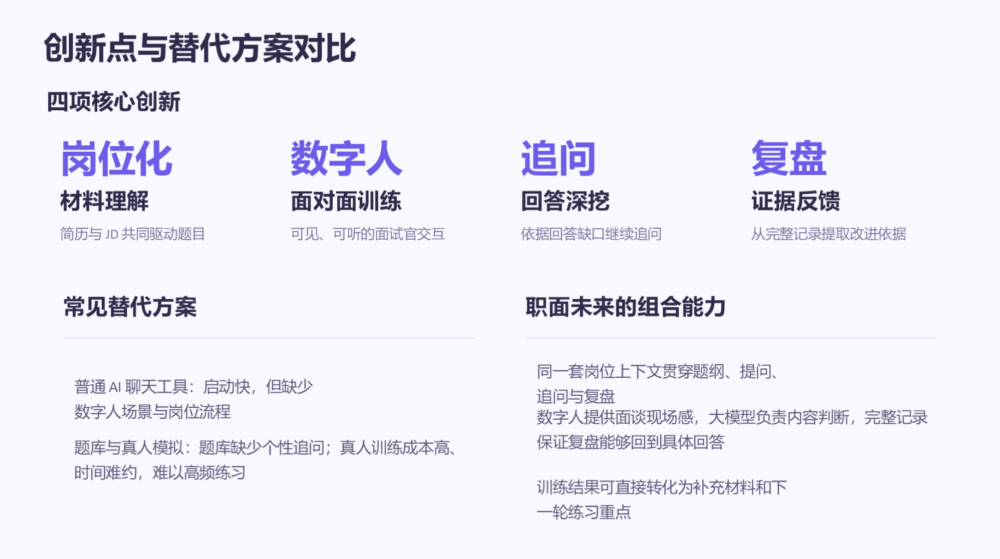

# JobFuture: Digital Human AI Interview Simulation & Review Coach

<div align="center">

**Face-to-Face Digital Human Interview Simulation & Structured Review Coach Driven by Real Resumes and Job Descriptions**

[](https://modelscope.cn/studios/Karlzhy/xmov-interview-coach-web)
[](https://www.python.org/)
[](https://www.deepseek.com/)
[](https://www.xmov.ai/)
[](LICENSE)

[🌐 Live Online Demo](https://modelscope.cn/studios/Karlzhy/xmov-interview-coach-web) • [Highlights](#core-highlights) • [Architecture](#system-technical-architecture) • [Walkthrough](#six-step-workflow--interface-walkthrough) • [Deployment](#environment-configuration--deployment) • [Comparison](#comparative-advantages)

</div>

---

## Project Overview

**JobFuture (职面未来)** is an end-to-end digital interview simulation and comprehensive review platform tailored for university graduates, early-career professionals, and job seekers. The system implements a complete training loop: **"Authentic Material Ingestion + Hyper-Realistic Digital Human Presence + Dynamic Follow-up Digging + 6-Dimensional Evidence-Based Review"**, bridging the gap between job understanding, live verbal delivery, and iterative improvement.

By simply providing a target Job Description (JD) and a resume, the LLM engine deconstructs core competency requirements and synthesizes an individualized interview blueprint. A 3D digital human interviewer conducts real-time face-to-face oral questioning over WebRTC. The system dynamically initiates in-depth follow-up questions targeting factual gaps in responses, and concludes with a structured diagnostic evaluation featuring evidence-backed recommendations for subsequent preparation.

<div align="center">
  
  <p><em>Figure 1: Full-cycle closed-loop training from material preparation to digital human evaluation and structured review</em></p>
</div>

---

## Addressing Core Pain Points

Job seekers routinely encounter three systemic hurdles during interview preparation:
1. **Fragmented Job Understanding**: Job descriptions contain dense, unorganized requirements, making key evaluation criteria difficult to isolate.
2. **Unstructured Experience Delivery**: Candidates struggle to organize personal project experiences into structured responses adhering to the STAR method with quantifiable outcomes during live conversations.
3. **Absence of Realistic Pressure & Actionable Feedback**: Text-based chat tools lack conversational tension. Conventional question banks offer generic grading rubrics without pinpointing factual deficiencies in user responses.

JobFuture creates authentic conversational presence through a realistic 3D interviewer avatar and anchors every question to the candidate's exact background, ensuring each practice session yields actionable insights.

---

## Core Highlights

- 🎯 **Role-Specific Tailored Blueprints**: Analyzing target roles, candidate resumes, JD requirements, and difficulty levels, the system synthesizes a structured blueprint covering candidate profiles, skill tags, and personalized question trajectories.
- 👤 **XMOV 3D Digital Human Integration**: Direct integration with the XMOV hyper-realistic avatar engine (defaulting to `N_Wuliping_14333_new`) provides low-latency WebRTC audio-visual streaming, realistic lip-sync, and authentic interviewer presence.
- 🔄 **Adaptive Dynamic Follow-up (Digging)**: Based on completeness and logical clarity in previous answers, the AI initiates 1 to 2 rounds of deep follow-up questions, replicating rigorous corporate interview environments.
- 🎙️ **Full-Duplex Multi-Modal Interaction**: Supports client-side microphone audio capture and text input, allowing flexible practice across different environments.
- 📋 **6-Dimensional Evidence-Based Diagnostics**: Extracts specific evidence chains from full interview transcripts, evaluating Overall Performance, Role Fit, Experiential Evidence, Technical Competence, Communication Structure, and Next-Round Action Plans.

<div align="center">
  
  <p><em>Figure 2: Six-dimensional evidence-based diagnostic evaluation framework</em></p>
</div>

---

## System Technical Architecture

The platform adopts a decoupled, high-cohesion architecture balancing responsive client interactions, cloud video streaming, and cognitive reasoning:

<div align="center">
  
  <p><em>Figure 3: System technical architecture and component division model</em></p>
</div>

### Component Responsibilities

```text
┌────────────────────────────────────────────────────────────────────────┐
│                        Frontend Client (Web Browser)                   │
│   Responsive 3-Column UI  │  WebRTC Media Player  │  Microphone Audio  │
│   State Management        │  Real-Time Transcripts│  Markdown Reports  │
└───────────────────────────────────┬────────────────────────────────────┘
                                    │ HTTP / HTTPS API
┌───────────────────────────────────▼────────────────────────────────────┐
│                       Backend Gateway (Python Core)                    │
│   Lightweight Multi-Threaded HTTP  │  Session State Machine            │
│   Preset Job Templates             │  Prompt Assembly & Relay Engine   │
└───────────────────┬────────────────────────────────┬───────────────────┘
                    │                                │
┌───────────────────▼──────────────┐ ┌───────────────▼───────────────────┐
│     Cognitive Engine (DeepSeek)  │ │   Avatar Engine (XMOV Nebula)     │
│  • Resume & JD Semantic Analysis │ │  • Cloud 3D Digital Human Render  │
│  • Role-Specific Question Design │ │  • Real-Time TTSA Lip-Sync Engine │
│  • Dynamic Follow-up Arbitration │ │  • WebRTC Low-Latency Streamer    │
│  • 6-Dimensional Evidence Review │ │  • Dynamic Camera & Gesture Cues  │
└──────────────────────────────────┘ └───────────────────────────────────┘
```

---

## Six-Step Workflow & Interface Walkthrough

### Step 1: Accessing the Preparation Workbench
Upon entering the platform, users interact with an intuitive three-column layout: the left panel handles input configurations, the center stage hosts the digital human, and the right panel displays blueprints and review outputs.

<div align="center">
  
  <p><em>Step 1: Accessing the three-column interview workbench</em></p>
</div>

### Step 2: Launching the Digital Human Interviewer
Clicking **Launch Digital Human** initializes a cloud session with XMOV. The WebRTC stream renders the interviewer on the central stage with live connection indicators.

<div align="center">
  
  <p><em>Step 2: Initializing WebRTC session and rendering the digital interviewer</em></p>
</div>

### Step 3: Configuring Job Requirements & Candidate Materials
Select target roles, interview styles (behavioral, technical, general), and challenge difficulties, then supply the resume and JD text. Presets (Product Manager, Frontend, Java Backend, etc.) offer one-click test loading.

<div align="center">
  
  <p><em>Step 3: Defining target role criteria and candidate background details</em></p>
</div>

### Step 4: Generating the Role-Specific Blueprint
Clicking **Generate Blueprint** triggers semantic parsing of the input materials, displaying extracted candidate profiles, skill badges, and customized inquiry trajectories.

<div align="center">
  
  <p><em>Step 4: Examining the tailored competency profile and question blueprint</em></p>
</div>

### Step 5: Conducting the Live Face-to-Face Interview
Clicking **Start Interview** begins oral questioning by the digital human. Candidates respond via microphone speech input or text entry.

<div align="center">
  
  <p><em>Step 5: Engaging in continuous oral questioning and verbal response capture</em></p>
</div>

### Step 6: Dynamic Follow-Up & Structured Review
The engine assesses response quality and dynamically issues follow-ups on ambiguous claims. At session close, a comprehensive evaluation report provides performance radar scores and actionable next-step drills.

<div align="center">
  
  <p><em>Step 6: Reviewing transcripts, follow-up chains, and 6-dimensional feedback</em></p>
</div>

---

## Comparative Advantages

<div align="center">
  
  <p><em>Figure 4: Comprehensive comparison of JobFuture with alternative approaches</em></p>
</div>

| Dimension | Generic Text LLMs | Fixed Question Banks | Human Mock Coaches | **JobFuture (This Project)** |
| :--- | :--- | :--- | :--- | :--- |
| **Conversational Atmosphere** | Plain text bubbles, zero presence | Static input forms, no live interaction | Authentic face-to-face delivery | **Hyper-realistic 3D video stream** |
| **Role Tailoring** | Relies on manual prompting | Generic static questions | Variable by coach background | **Deeply anchored to candidate JD & resume** |
| **Follow-up Depth** | Concludes after single answers | No dynamic follow-ups | Follow-ups possible | **Adaptive digging on answer gaps** |
| **Feedback Quality** | General advice or broad summaries | Simple answer keys | Subjective verbal feedback | **6-dimensional evidence-based report** |
| **Cost & Frequency** | Low cost, anytime | Fixed questions lose value quickly | Expensive, scheduling delays | **Low marginal cost, 24/7 repeated practice** |

---

## Environment Configuration & Deployment

### 1. Prerequisites & Environment Variables

Configure system environment variables or copy the `.env` template:

```bash
cp .env.example .env
```

`.env` Configuration Parameters:

```ini
# DeepSeek LLM Configuration
DEEPSEEK_API_KEY=your_deepseek_api_key_here
DEEPSEEK_MODEL=deepseek-chat

# XMOV Nebula Digital Human Platform Configuration
XMOV_APP_ID=your_xmov_app_id_here
XMOV_APP_SECRET=your_xmov_app_secret_here
XMOV_GATEWAY=https://nebula-agent.xingyun3d.com/user/v1/ttsa/session
XMOV_AVATAR_LOOK=N_Wuliping_14333_new

# Server Network Configuration
HOST=0.0.0.0
PORT=7860
```

> Obtain XMOV credentials from the [XMOV Open Platform](https://xingyun3d.com/) and DeepSeek API keys from the [DeepSeek Platform](https://platform.deepseek.com/).

---

### 2. Method 1: Local Python Execution

The application utilizes standard Python libraries without heavy external web frameworks:

```bash
# Clone repository
git clone https://github.com/Karl-XZ/xmov-interview-coach-web.git
cd xmov-interview-coach-web

# Launch application (Python 3.10+)
python app.py
```

Access in your browser: `http://127.0.0.1:7860`.

> **Browser Microphone Permission**: Non-localhost deployments require HTTPS to permit client microphone capture under standard browser security models.

---

### 3. Method 2: Docker Container Deployment

A minimal Dockerfile is included for containerized environments:

```bash
# Build container image
docker build -t xmov-interview-coach .

# Run container
docker run -d \
  --name xmov-coach \
  -p 7860:7860 \
  --env-file .env \
  xmov-interview-coach
```

---

## Typical Application Scenarios

1. **University Career Centers & Interview Bootcamps**: Scales career guidance by enabling students to practice targeted interviews with immediate diagnostic summaries.
2. **Intensive Pre-Interview Drills**: Enables job seekers to run 3 to 5 targeted mock sessions against specific company JDs within 48 hours of formal interviews.
3. **Recruitment Platform Candidate Screening**: Embedded before application submission to help applicants evaluate readiness and strengthen technical delivery.

---

## Privacy, Security & Disclaimers

1. **Data Privacy**: Resume and JD inputs are processed ephemerally within memory for the duration of the training session and are not permanently stored in public environments.
2. **Platform Scope**: Feedback reports and scoring rubrics serve educational and preparation purposes. Actual corporate hiring outcomes depend on employer interview evaluations.
